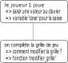

Déroulement du jeu
------------------

Le déroulement du jeu doit être réfléchi pour anticiper les différentes situations rencontrées dans une partie. On peu schématiser ce déroulement avec un **organigramme**. Un organigramme est un graphe (ensemble de rectangles reliés entre eux par des flèches) pour montrer les différentes étapes du déroulement du jeu. 

Chaque rectangle contient une action du joueur ou une étape du jeu. Cet organigramme permet de penser la structure du programme principal.

Par exemple, cela permet de:

-  poser les différentes variables utiles au programme;
-  réfléchir à l'écriture d'une fonction pour réaliser une action;
-  mettre en évidence une structure conditionnelle correspondant à 2 issues possibles du jeu;
-  mettre en évidence la necessité d'une boucle.

On donne ci-dessous le début possible d'un organigramme du jeu:

Créer un organigramme du jeu du morpion et en déduire les variables utiles, les fonctions à construire et la structure du programme principal.