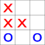

Jeu "Tic Tac Toe" ou "Morpion"
==============================

Le jeu "Tic Tac Toe" est un jeu à 2 joueurs, jouant chacun leur tour, en déposant sur une grille carrée de 9 cases des pions. Le gagnant est le premier des 2 joueurs qui aligne 3 pions horizontalement, verticalement ou en diagonale.

L'objectif est de programmer ce jeu à 2 joueurs en respectant certaines contraintes:

- la grille de jeu sera définie par un tableau;
- la pose d'un pion d'un joueur est réalisée avec le pavé numérique du clavier.

.. toctree::
   :maxdepth: 1
   :hidden:

   content/scenariser.rst
   content/coder.rst
   content/verifier_afficher.rst